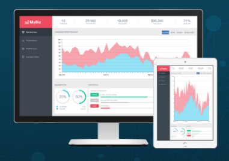
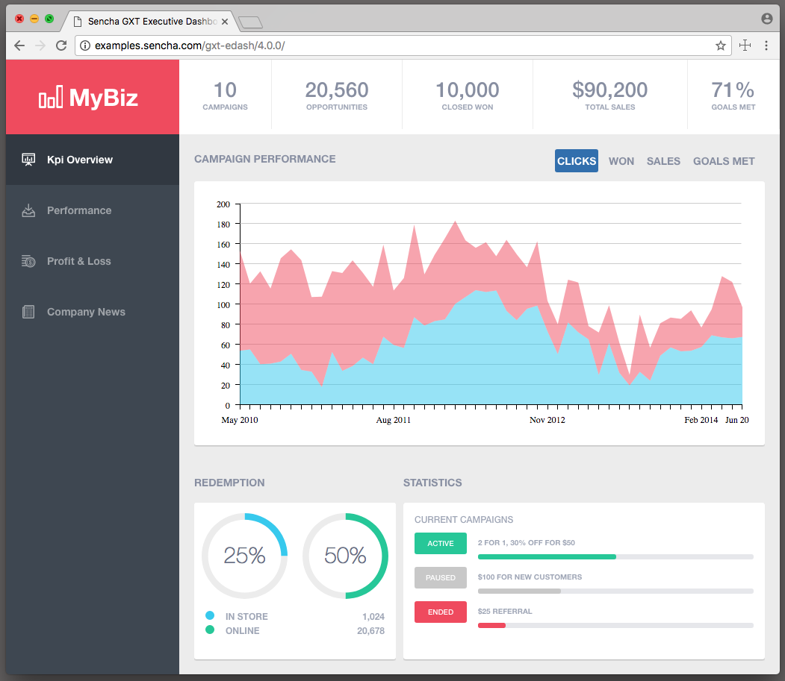
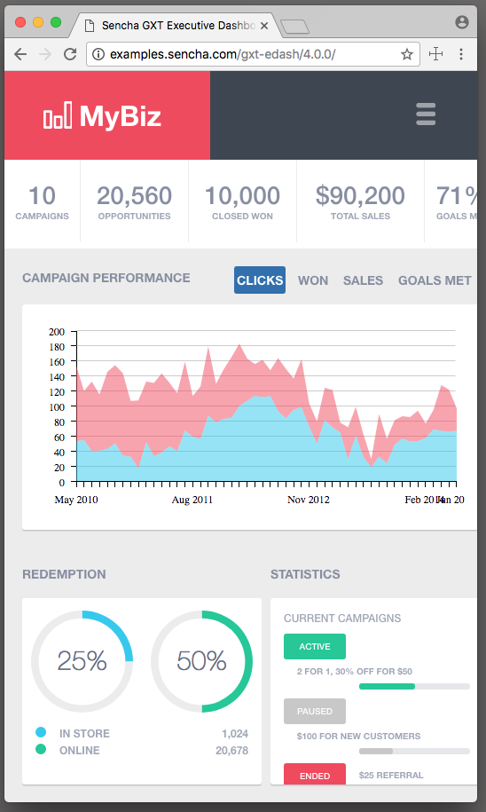

# GXT Executive Dashboard Demo
Example GXT 4.0 application using the theme builder to build a theme.

{::nomarkdown}

	
	
	

{:/}

## Demo

* [Dashboard Demo](http://examples.sencha.com/gxt-edash/)

## Requirements
This project depends on the latest release of GXT. 

## Project setup
* Run `mvn install` to initialize project and custom theme. 

### Maven setup
Maven will need credentials to access the GXT 4.0 artifact dependencies. 

* Find out more with getting started with [GXT Maven here](http://docs.sencha.com/gxt/latest/getting_started/maven/Maven.html).

## Running super dev mode
Setup a Super Dev mode launcher for the gxt-edash module and run index.html.

